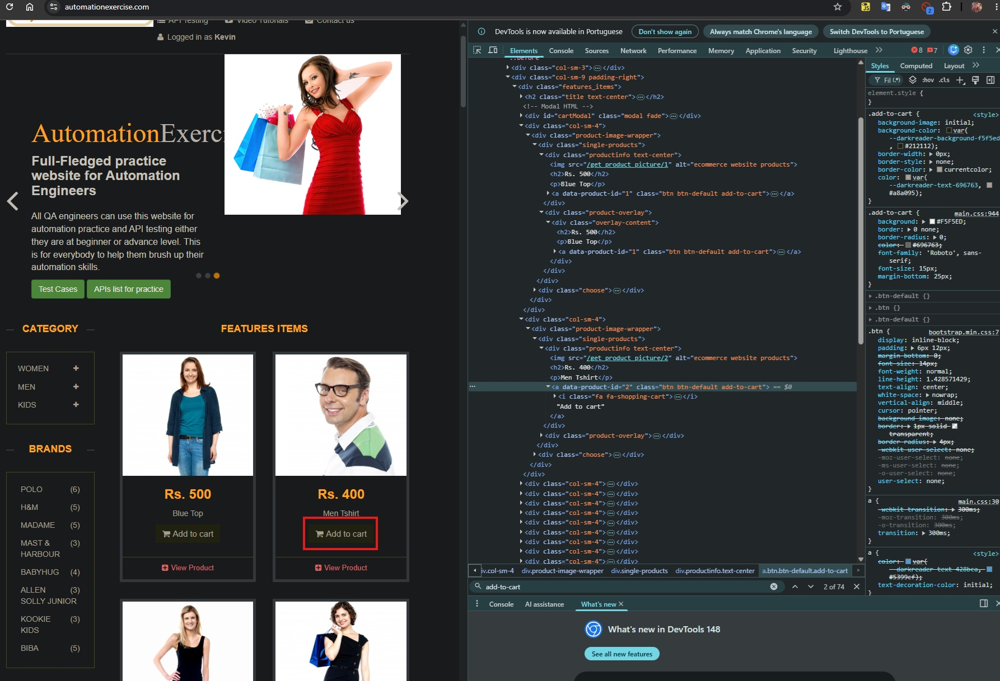
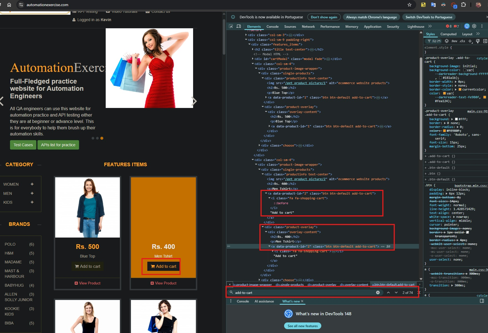
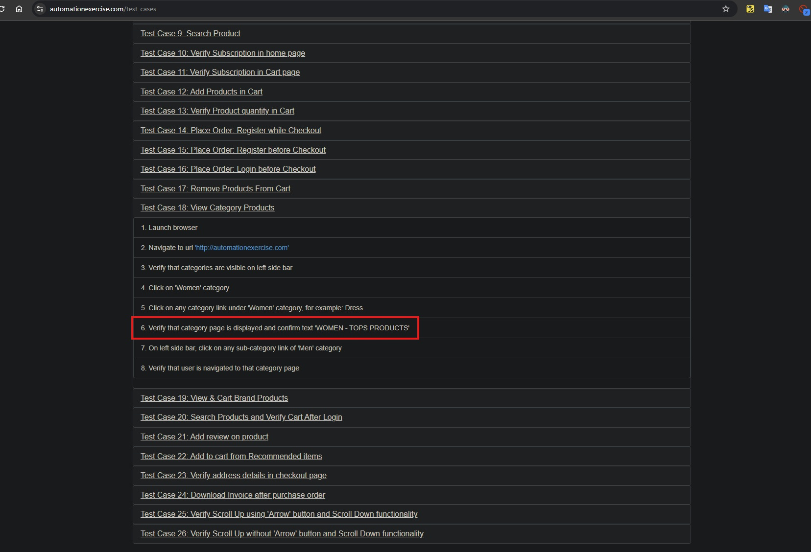
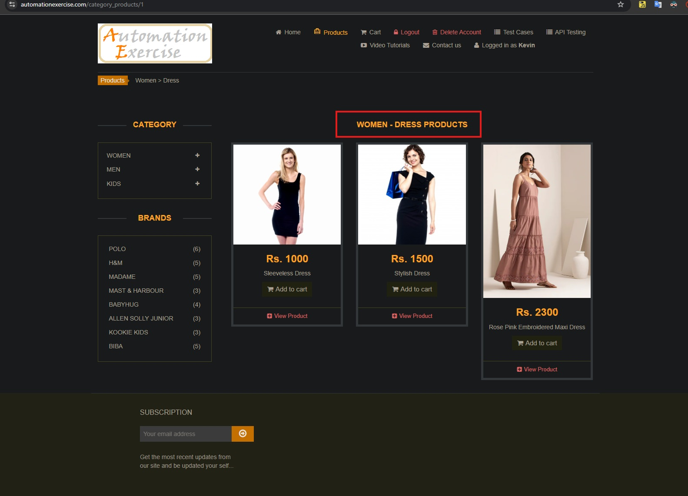

## 📋 Sumário
1. [Parte 1: Estratégia, BDD e Testes Manuais (Visão de Produto)](#parte-1-estratégia-bdd-e-testes-manuais-visão-de-produto)
   - [Cenário BDD (Gherkin)](#cenário-bdd-gherkin)
   - [Testes Exploratórios / Edge Cases](#testes-exploratórios--edge-cases)
2. [Parte 2: Automação (Engenharia de Código)](#parte-2-automação-engenharia-de-código)
   - [Pré-requisitos](#pré-requisitos)
   - [Instalação](#instalação)
   - [Como Executar os Testes](#como-executar-os-testes)
   - [Estrutura do Projeto](#estrutura-do-projeto)
3. [Parte 3: Bug Report](#parte-3-bug-report)
   - [Tickets Oficiais (Padrão Jira)](#tickets-oficiais-padrão-jira)
   - [🔍 Menções Honrosas (Sessão Exploratória)](#-menções-honrosas-sessão-exploratória)

---

## Parte 1: Estratégia, BDD e Testes Manuais (Visão de Produto)

### Cenário BDD (Gherkin)
O fluxo escolhido foi o **"Place Order: Register while Checkout"**. A escrita abaixo prioriza a linguagem de negócio e o valor do produto, evitando descrições muito imperativas de cliques e focando no comportamento esperado do sistema.

```
```gherkin
Funcionalidade: Checkout e Registro de Usuário Integrado
  Como um cliente do e-commerce
  Quero poder me registrar durante o processo de finalização de compra
  Para que eu possa criar uma conta e concluir meu pedido em um fluxo unificado

  Cenário: Finalizar compra registrando um novo usuário no checkout com sucesso
    Dado que o cliente adicionou produtos de interesse ao carrinho de compras
    Quando ele prossegue para a etapa de finalização da compra (Checkout)
    E opta por criar uma nova conta preenchendo seus dados cadastrais dinâmicos
    E confirma as informações de faturamento e endereço de entrega
    E insere dados válidos na etapa de pagamento
    Então o pedido deve ser processado e concluído com sucesso
    E o sistema deve exibir a confirmação de sucesso da compra
    E a nova conta do usuário deve constar como ativa e registrada no sistema

```

```gherkin
Cenário: Tentativa de finalizar compra com carrinho vazio
  Dado que o cliente não adicionou nenhum produto ao carrinho de compras
  Quando ele tenta prosseguir diretamente para a etapa de checkout
  Então o sistema deve impedir o avanço do fluxo
  E redirecionar o cliente para a loja ou exibir uma mensagem informando que o carrinho está vazio

Cenário: Bloqueio de registro com e-mail já cadastrado durante o checkout
  Dado que o cliente adicionou produtos ao carrinho e optou por criar uma nova conta
  Quando ele informa um e-mail que já possui cadastro ativo no sistema
  Então o pedido não deve ser processado
  E o sistema deve exibir a mensagem de erro informando que o e-mail já está em uso


```

### Testes Exploratórios / Edge Cases

Aplicando técnicas como *Análise de Valor Limite* e *Particionamento de Equivalência*, foram desenhados pelo menos 3 cenários manuais focados em exceções para testar a resiliência das etapas de carrinho e pagamento:

####  Cenário 1: Manipulação de Quantidade com Valores Limites e Inválidos

* **Descrição:** No carrinho de compras, tentar alterar manualmente o campo de quantidade de um produto para valores inesperados como `0`, números negativos (ex: `-5`) ou caracteres alfanuméricos/especiais (ex: `abc`, `@#$`), antes de avançar para o checkout.
* **Objetivo de Qualidade:** Garantir que o front-end e a API validem o input de forma restritiva. O sistema deve impedir a inserção de valores inválidos, reajustar para a quantidade mínima unitária (`1`), ou exibir uma mensagem de erro amigável, impedindo cálculos de totais negativos ou quebras de layout.

####  Cenário 2: Quebra do Fluxo de Sessão (Bypass de Autenticação via URL)

* **Descrição:** Adicionar produtos ao carrinho, avançar no fluxo até a tela final de "Pagamento" (`/payment`) e copiar a URL completa da página. Em seguida, deslogar do sistema (ou abrir uma nova janela anônima) e tentar colar a URL diretamente na barra de endereços para acessar a página sem autenticação ativa.
* **Objetivo de Qualidade:** Validar o gerenciamento de sessão de rotas protegidas no back-end. O sistema deve bloquear o acesso direto a páginas de checkout e pagamento para usuários não autenticados ou sem carrinhos ativos, redirecionando o cliente imediatamente para a tela de login ou home page.

####  Cenário 3: Estresse e Injeção de Campos no Formulário de Pagamento

* **Descrição:** Na etapa de pagamento, preencher os campos do Cartão de Crédito (Nome do Titular, Número do Cartão, CVC e Expiração) com um volume massivo de dados (ex: colar 5.000 caracteres) ou injetar scripts básicos estruturados em HTML/JS (ex: `<script>alert('XSS')</script>`).
* **Objetivo de Qualidade:** Avaliar a resiliência sanitária dos inputs contra vulnerabilidades de *Cross-Site Scripting* (XSS) e erros de banco de dados por estresse de tamanho (*Data Truncation*). O sistema deve tratar ou sanitizar as entradas sem executar código malicioso e sem expor logs internos no console ou stack traces do servidor.

---

## Parte 2: Automação (Engenharia de Código)

O projeto de automação foi construído utilizando **Cypress**, cobrindo tanto testes de integração de API quanto cenários de ponta a ponta (E2E) de UI, com massa de dados totalmente dinâmica utilizando a biblioteca `@faker-js/faker`.

###  Pré-requisitos

* [Node.js](https://nodejs.org/) (Versão 18 ou superior recomendada)
* npm (Já vem instalado com o Node)

###  Instalação

1. Clone este repositório:
```bash
git clone https://github.com/kevinpraisner/gclick-qa-cypress.git
cd gclick-qa-cypress

```


2. Instale todas as dependências do projeto:
```bash
npm install

```


###  Como Executar os Testes

#### Modo Interativo (Interface Gráfica)

Para abrir o Cypress Test Runner e acompanhar a execução visualmente:

```bash
npx cypress open

```

*Selecione "E2E Testing", escolha o navegador de sua preferência (Chrome/Electron) e clique na spec que deseja executar.*

#### Modo Headless (Via Terminal / CI-CD)

Para rodar todos os testes em segundo plano e gerar os resultados direto no console:

```bash
npx cypress run

```

###  Estrutura do Projeto

A arquitetura segue boas práticas de engenharia de software e manutenibilidade:

```text
gclick-qa-cypress/
├── cypress/
│   ├── e2e/
│   │   ├── api.cy.js          # Automação de API (GET Schema e POST Dinâmico)
│   │   └── checkout.cy.js     # Automação de UI (Fluxo de compra ponta a ponta)
│   ├── support/
│   │   ├── commands.js        # Comandos customizados (se aplicável)
│   │   └── e2e.js             # Configurações globais de suporte
├── cypress.config.js          # Arquivo principal de configuração do Cypress
├── package.json               # Gerenciamento de scripts e dependências do Node
└── README.md                  # Documentação principal da solução

```

###  Cobertura dos Testes

#### `api.cy.js` — Testes de API
- **GET /productsList** → valida status HTTP 200 e o contrato do schema de resposta
  (campos obrigatórios: `id`, `name`, `price`, `category`)
- **POST /createAccount** → cria um novo usuário com dados dinâmicos gerados via
  `@faker-js/faker` e valida o `responseCode 201` retornado pela API

#### `checkout.cy.js` — Teste E2E de UI
- Acessa o site e adiciona 2 produtos distintos ao carrinho
- Prossegue para o checkout e realiza o registro dinâmico de um novo usuário
- Valida se os produtos corretos aparecem na tela de revisão do pedido
- Preenche os dados de pagamento e confirma a mensagem de sucesso da compra

---

## Parte 3: Bug Report

Durante as sessões de exploração manual e desenvolvimento dos scripts automatizados, foram identificados comportamentos anômalos no site *Automation Exercise*. Seguindo as orientações do desafio, foram selecionados **2 bugs oficiais** para documentação formal estruturada no padrão do Jira, seguidos de outras descobertas relevantes.

### Tickets Oficiais (Padrão Jira)

#### 🐛 Bug Report 1: Elementos "Add to Cart" duplicados no DOM

| Campo | Detalhe |
|---|---|
| **Título** | [Arquitetura UI] - Elementos "Add to cart" duplicados no DOM geram ambiguidade e fragilizam seletores de automação |
| **Severidade** | Média |
| **Prioridade** | Média |
| **Status** | Aberto |
| **Componente** | Front-end / Product Listing |
| **Ambiente** | Google Chrome 125.0 / Windows 11 |
| **Versão da aplicação** | automationexercise.com (produção) |
| **Reportado por** | Kevin (QA Analyst) |

**Descrição:**
Cada card de produto na seção "Feature Items" renderiza dois elementos
"Add to cart" idênticos no DOM simultaneamente — um visível no estado
estático e outro oculto para efeito de hover/animação. Isso viola boas
práticas de acessibilidade e quebra locators de automação baseados em texto.

**Passos para Reproduzir:**
1. Acessar `https://automationexercise.com/`
2. Rolar até a seção "Feature Items"
3. Abrir o DevTools (F12) → aba Elements
4. Inspecionar o HTML de qualquer card de produto
5. Buscar pela string "Add to cart" dentro do card

**Resultado Esperado:**
Cada card de produto deve conter apenas um único elemento "Add to cart"
no DOM, garantindo conformidade com regras de acessibilidade e permitindo
que seletores baseados em texto funcionem sem ambiguidade.

**Resultado Atual:**
O DOM renderiza dois botões "Add to cart" idênticos por produto.
Comandos como `cy.contains('Add to cart')` falham por retornar múltiplos
elementos sem distinção, exigindo workarounds como `.first()` ou seletores
por índice, o que fragiliza a manutenibilidade da automação.

**Evidência:**


---

#### 🐛 Bug Report 2: Inconsistência entre Test Case 18 e título real da página

| Campo | Detalhe |
|---|---|
| **Título** | [Documentação] - Especificação do Test Case 18 diverge do título renderizado na página de categoria |
| **Severidade** | Baixa |
| **Prioridade** | Baixa |
| **Status** | Aberto |
| **Componente** | Documentação / Test Cases |
| **Ambiente** | Qualquer navegador / Qualquer OS |
| **Versão da aplicação** | automationexercise.com (produção) |
| **Reportado por** | Kevin (QA Analyst) |

**Descrição:**
O passo 6 do Test Case 18 instrui validar o texto `"WOMEN - TOPS PRODUCTS"`
ao navegar para a subcategoria "Dress" dentro de "Women". Porém o título
real renderizado na página é `"WOMEN - DRESS PRODUCTS"`, gerando quebra
imediata em automações baseadas estritamente na especificação oficial do site.

**Passos para Reproduzir:**
1. Acessar `https://automationexercise.com/`
2. No menu lateral "Category", expandir a seção "Women"
3. Clicar na subcategoria "Dress"
4. Observar o título H2 exibido no topo da listagem de produtos
5. Comparar com o passo 6 descrito em `https://automationexercise.com/test_cases`

**Resultado Esperado:**
A especificação do Test Case 18 deve ser corrigida para refletir o
comportamento real da aplicação. O texto de validação no passo 6 deveria
ser `"WOMEN - DRESS PRODUCTS"`, correspondendo à subcategoria navegada.

**Resultado Atual:**
A documentação instrui validar `"WOMEN - TOPS PRODUCTS"`, mas a página
renderiza `"WOMEN - DRESS PRODUCTS"`. Qualquer assertion estrita baseada
na especificação falha, induzindo o QA a acreditar que há um bug na UI
quando o problema está na documentação.

**Evidência:**



---

### 🔍 Menções Honrosas (Sessão Exploratória)

Para demonstrar um processo completo de investigação de qualidade indo além do limite padrão de 2 incidentes, seguem listadas outras 3 falhas críticas observadas durante a análise técnica da aplicação:

* **1. Nome ausente no carrossel "Recommended Items":** Na página principal, ao rolar até a seção de itens recomendados, o terceiro card de produto apresenta uma falha de layout grave onde a tag que deveria conter o nome do produto renderiza uma cópia duplicada do preço (exibindo `<h2>Rs. 1000</h2>` seguido de um texto avulso `Rs. 1000`), ocultando completamente a identidade do item para o usuário final.
* **2. Checkout e Pagamento aceitam qualquer dado de cartão fictício:** O formulário final da rota de pagamento não executa validações de regras de negócio complexas ou máscaras no back-end para o cartão de crédito. É possível preencher números sequenciais óbvios (ex: `1234 5678 ...`), CVC inválido (`000`) ou datas de validade expiradas no passado, e a aplicação prossegue autorizando o pedido com uma mensagem de sucesso falso, evidenciando uma falha grave de simulação de sandbox ou validação de contratos de gateway.
* **3. Google Ads sobrepondo elementos interativos em viewports reduzidos:** O site renderiza anúncios dinâmicos do Google Ads que, dependendo da resolução de tela configurada no navegador (ex: viewports de automação padrão como 1024x768), cobrem fisicamente botões importantes como `Add to cart` ou `View Product`. Isso causa erros intermitentes do tipo `ElementClickInterceptedException`, exigindo a implementação de boas práticas de contorno de engenharia, como o uso do parâmetro `{ force: true }` no clique do Cypress para forçar a interação do elemento ocultado pelo iframe do anúncio.

---
